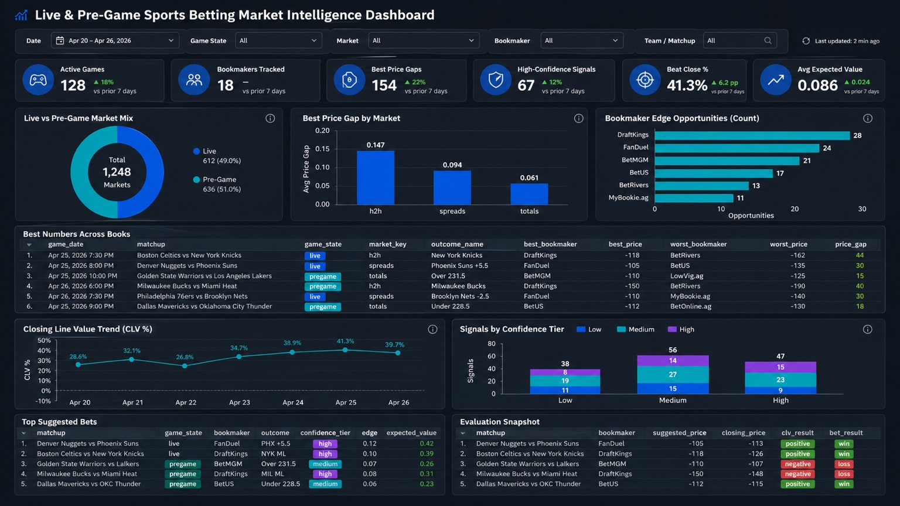
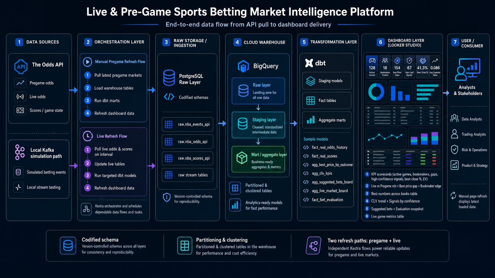

# Live & Pre-Game Sports Betting Market Intelligence Platform

A production-style data engineering capstone that pulls NBA market data from APIs, processes it through a reproducible warehouse pipeline, and delivers a dashboard for **live market monitoring, pregame price comparison, bookmaker edge discovery, and bet evaluation**.

This version of the project is built around a **fixed dashboard design**, **two Kestra refresh paths**, **codified raw schemas**, and **warehouse optimization through partitioning and clustering** so the platform is both more useful and more production-like.

---

## Problem This Capstone Solves

Sports betting markets move quickly, but raw odds feeds alone do not make it easy to answer practical questions such as:

- Which books currently have the **best number**?
- Where are the **largest price gaps** across books?
- Which games are **live vs pregame** right now?
- Which suggested bets appear to have the strongest **edge / expected value**?
- Are suggested bets actually **beating the closing line**?
- How can live and pregame market data be refreshed reliably for a dashboard view?

The capstone solves this by turning raw sportsbook market data into a structured analytics system that supports market intelligence, line shopping, live monitoring, and evaluation.

---

## Solution Overview

This project builds an end-to-end data platform that:

1. Pulls **pregame odds, live odds, scores, and game-state data** from The Odds API.
2. Lands raw data into a **codified PostgreSQL raw layer**.
3. Loads curated raw tables into **BigQuery**.
4. Uses **dbt** to build staged, fact, and aggregate models.
5. Serves a polished **Looker Studio dashboard** for live and pregame market monitoring.
6. Uses **two Kestra flows**:
   - a **manual pregame refresh flow**
   - a **live refresh flow** for in-game updates

---

## Final Dashboard Target

The dashboard is designed to look like the reference below and will remain organized into fixed sections so the reporting experience stays clean and repeatable.



### Dashboard Layout

**Row 1 — KPI Scorecards**
- Active Games
- Bookmakers Tracked
- Best Price Gaps
- High-Confidence Signals
- Beat Close %
- Avg Expected Value

**Row 2 — Market Overview Charts**
- Live vs Pre-Game Market Mix
- Best Price Gap by Market
- Bookmaker Edge Opportunities

**Row 3 — Best Numbers Across Books**
- Table showing matchup, game state, market, outcome, best/worst bookmaker, best/worst price, and price gap

**Row 4 — Performance / Signal Monitoring**
- Closing Line Value Trend (CLV %)
- Signals by Confidence Tier

**Row 5 — Suggestion + Evaluation Tables**
- Top Suggested Bets
- Evaluation Snapshot

**Row 6 — Live Game Metrics Table**
- Latest live metrics available from the API, such as game state, latest prices, live score context, and other in-game fields surfaced by the live refresh flow

---

## End-to-End Data Engineering Flow

The platform follows the architecture shown below.



---

## Architecture Overview

The platform combines **API ingestion**, **optional local stream simulation**, **cloud warehousing**, **analytics engineering**, **orchestration**, and **BI delivery**.

### High-Level Flow

#### Path A — Manual Batch Market Refresh
1. The Odds API provides real NBA events, odds, and scores
2. Python ingestion jobs load raw market data into PostgreSQL
3. BigQuery loaders move those raw tables into the analytics warehouse
4. dbt builds staging, mart, and aggregate models for reporting
5. Kestra can run the full manual refresh flow end to end
6. Looker Studio reads the curated models and displays live and pre-game market analytics

#### Path B — Kafka Local Streaming Pipeline
1. Kafka producers generate sportsbook-style event streams for bets, odds updates, and game updates
2. Kafka consumers read those messages and persist them into PostgreSQL raw stream tables
3. BigQuery loaders move stream tables into the analytics warehouse
4. dbt builds analytics models from the stream-backed warehouse tables
5. Looker Studio reads the resulting stream-informed dashboard tables

---

## Architecture Components

### Market Data Sources
- NBA event schedule and event IDs
- real bookmaker odds for moneyline, spreads, and totals
- live and completed score updates
- bookmaker-specific price snapshots across multiple books

### Streaming Sources
- simulated bet events
- simulated odds update events
- simulated game update events

### Storage Layer
Data is persisted across:
- **PostgreSQL** for local ingestion and operational staging
- **BigQuery** for warehouse modeling and dashboard consumption

### Transformation Layer
dbt is used to build:
- source cleanup models
- event and odds fact tables
- game-level market board models
- suggestion / evaluation models
- dashboard aggregates
- stream-backed betting activity and odds movement tables

### Orchestration Layer
Kestra is used to:
- manually refresh market data
- run end-to-end update flows
- automate warehouse refreshes later if desired
- serve as the future control point for a more automated streaming refresh path

### Analytics Layer
Looker Studio surfaces:
- overview KPIs
- live market board
- suggested bets board
- evaluation board
- research board
- historical stream-backed betting and odds movement views

---

## Data Layers

### 1. Ingestion Layer
Raw data pulled from The Odds API and local Kafka event streams, first stored in PostgreSQL.

### 2. Warehouse Raw Layer
Raw source tables loaded into BigQuery with minimal reshaping.

### 3. Staging Layer
dbt views that standardize field names, cast types, and prepare data for downstream joins.

### 4. Mart Layer
dbt tables that model core business entities such as events, odds history, scores, suggestions, and evaluation.

### 5. Dashboard Layer
Looker Studio reads curated aggregate tables designed for sportsbook-style monitoring and evaluation.

---

## Tech Stack

### Core
- Python
- SQL

### Infrastructure
- Docker
- Terraform
- GCP

### Storage
- PostgreSQL
- BigQuery
- Google Cloud Storage

### Streaming / Platform Support
- Kafka
- Zookeeper

### Transformation
- dbt

### Orchestration
- Kestra

### Analytics / BI
- Looker Studio

### Version Control
- GitHub

---

## Repository Structure

```text
project-root/
│
├── ingestion/
│   ├── api_clients/
│   ├── batch_jobs/
│   ├── producers/
│   └── schemas/
│
├── streaming/
│   ├── consumers/
│   ├── validators/
│   ├── transforms/
│   └── dlq/
│
├── orchestration/
│   └── kestra/
│
├── dbt/
│   └── sportsbook_dbt/
│       ├── models/
│       │   ├── staging/
│       │   └── marts/
│       ├── tests/
│       ├── macros/
│       └── dbt_project.yml
│
├── terraform/
│   ├── main.tf
│   ├── variables.tf
│   └── terraform.tfvars
│
├── sql/
│   └── create_raw_market_tables.sql
│
├── dashboard/
│   └── looker_studio/
│
├── docs/
│   └── images/
│       ├── final_dashboard_reference.png
│       └── data_pipeline_overview.png
│
├── docs/
├── docker-compose.yml
├── docker-compose.kestra.yml
├── requirements.txt
├── README.md
└── .env.example
```

---

## Current Data Model

The warehouse is centered around both real market data and stream-capable betting analytics.

### Core Real Market Models
- `dim_events`
- `fact_real_odds_history`
- `fact_real_scores`

### Live Market / Dashboard Models
- `agg_latest_real_odds_by_game`
- `agg_live_market_board`
- `agg_platform_kpis`
- `agg_best_price_by_outcome`
- `agg_clv_kpis`

### Suggestion / Evaluation Models
- `fact_bet_suggestions`
- `agg_suggested_bets_board`
- `fact_bet_evaluation`
- `agg_clv_summary`
- `agg_suggestion_performance_summary`

### Research / Context Models
- `fact_game_research_signals`
- `agg_research_board`

### Kafka / Stream-Oriented Models
- `stg_bet_events`
- `stg_odds_updates`
- `stg_game_updates`
- `fact_bets`
- `fact_odds_history`
- `agg_betting_activity_by_game`
- `agg_market_type_summary`
- `agg_odds_movement_by_game`
- `agg_live_vs_pregame_bet_mix`

These stream-oriented models remain useful because they show how a live event-driven betting pipeline can be modeled, even while the current production-style dashboard is centered on real odds and score feeds.

---

## Raw Schema Setup

All PostgreSQL raw source tables are defined in version-controlled SQL so the ingestion layer can be recreated consistently without manual table creation.

Example setup:

```bash
psql -h localhost -U postgres -d sportsbook -f sql/create_raw_market_tables.sql
```

Core raw tables include:
- `raw.nba_events_api`
- `raw.nba_odds_api`
- `raw.nba_scores_api`
- `raw.bet_events_stream`
- `raw.odds_updates_stream`
- `raw.game_updates_stream`

---

## Environment Setup

Clone the repository:

```bash
git clone <your-repo-url>
cd <your-repo-folder>
```

Create and activate a virtual environment:

```bash
python3 -m venv .venv
source .venv/bin/activate
```

Install dependencies:

```bash
pip install -r requirements.txt
pip install dbt-bigquery
```

Create your environment file:

```bash
cp .env.example .env
```

Recommended `.env` values:

```env
POSTGRES_DB=sportsbook
POSTGRES_USER=postgres
POSTGRES_PASSWORD=your_postgres_password
POSTGRES_HOST=localhost
POSTGRES_PORT=5432

KAFKA_BOOTSTRAP_SERVERS=localhost:9092

GCP_PROJECT_ID=your_gcp_project_id
GCS_BUCKET=your_bucket_name
BIGQUERY_DATASET=de26_sportsbook_analytics

BALLDONTLIE_API_KEY=your_balldontlie_key
THE_ODDS_API_KEY=your_the_odds_api_key
THE_ODDS_SPORT=basketball_nba
THE_ODDS_REGIONS=us
THE_ODDS_MARKETS=h2h,spreads,totals
```

---

## Infrastructure Setup

### Google Cloud Authentication

Authenticate locally before using Terraform, loaders, or dbt:

```bash
gcloud auth login
gcloud auth application-default login
gcloud config set project YOUR_GCP_PROJECT_ID
```

### Terraform

From the `terraform/` directory:

```bash
terraform init
terraform plan
terraform apply
```

This provisions the core GCP resources used by the warehouse.

---

## Start Local Services

Start the local stack:

```bash
docker compose up -d
docker ps
```

Expected containers:
- `sportsbook_postgres`
- `sportsbook_zookeeper`
- `sportsbook_kafka`

Start Kestra separately when needed:

```bash
docker compose -f docker-compose.kestra.yml up -d
```

---

## Pipeline Path A — Manual Batch Market Refresh

This is the current primary refresh path for the real market dashboard.

### 1. Pull real NBA event, odds, and score data
```bash
python -m ingestion.batch_jobs.load_nba_events_api
python -m ingestion.batch_jobs.load_nba_odds_api
python -m ingestion.batch_jobs.load_nba_scores_api
```

### 2. Load raw market tables into BigQuery
```bash
python -m ingestion.batch_jobs.load_nba_market_tables_to_bigquery
```

### 3. Build dbt models
Always run dbt from the correct project path:

```bash
cd dbt/sportsbook_dbt
dbt debug
dbt run
```

### 4. Refresh the full pipeline manually with Kestra
Use the manual refresh flow in Kestra to:
- refresh events
- refresh odds
- refresh scores
- load raw market tables to BigQuery
- rebuild dbt models

This path is ideal when:
- you want to conserve free-tier API calls
- you want a daily or manual refresh cycle
- you want the dashboard to reflect the most recent full warehouse state

---

## Pipeline Path B — Kafka Local Streaming Pipeline

This is the event-driven simulation path that shows how a live sportsbook stream can work.

### 1. Start Kafka consumers
Run consumers first so they are ready to receive stream events:

```bash
python -m streaming.consumers.bets_consumer
python -m streaming.consumers.odds_consumer
python -m streaming.consumers.game_updates_consumer
```

### 2. Start Kafka producers
Run producers to generate local sportsbook-style stream events:

```bash
python -m ingestion.producers.bets_producer
python -m ingestion.producers.odds_producer
python -m ingestion.producers.game_updates_producer
```

### 3. Load stream-backed raw tables into BigQuery
```bash
python -m ingestion.batch_jobs.load_stream_tables_to_bigquery
```

### 4. Rebuild dbt stream models
```bash
cd dbt/sportsbook_dbt
dbt run
```

This path is ideal when:
- you want to demonstrate streaming architecture knowledge
- you want to simulate live betting-style event flow
- you want to show how Kafka events can be landed, modeled, and visualized

### What an automated streaming version would look like
If you enable this path through Kestra later, the flow would look like:
1. trigger producer jobs on an interval
2. consume and store messages continuously
3. micro-batch or periodic-load stream tables into BigQuery
4. run dbt models on a short cadence
5. refresh the dashboard with near-real-time warehouse updates

That would turn the current local Kafka simulation into a more operational streaming refresh pattern.

---

## Two Kestra Refresh Paths

### 1. Manual Pregame Refresh Flow
Used for controlled refreshes of pregame market data.

High-level flow:
1. Pull latest pregame markets
2. Load raw / warehouse tables
3. Run dbt marts
4. Refresh dashboard data

### 2. Live Refresh Flow
Used during active games to keep live data current.

High-level flow:
1. Poll live odds and scores on an interval
2. Update live raw tables
3. Run targeted dbt models
4. Refresh dashboard data

This split keeps the project practical and cost-aware while still supporting a near-live dashboard experience.

---

## Partitioning and Clustering

A key improvement from earlier feedback is making warehouse tables more production-like by explicitly using **partitioning** and **clustering** where appropriate.

### Why it matters
- improves query performance
- reduces BigQuery scan cost
- makes dashboards faster
- makes the warehouse design more realistic

### Target approach
Typical mart / fact tables should be:
- **partitioned by date**, such as `game_date`, `snapshot_date`, or `loaded_at`
- **clustered by frequently filtered fields**, such as:
  - `event_id`
  - `bookmaker_title`
  - `market_key`
  - `game_state`

### Recommended partition / cluster targets
- `fact_real_odds_history`
- `fact_real_scores`
- `fact_bet_suggestions`
- `fact_bet_evaluation`
- `agg_latest_real_odds_by_game`
- `agg_best_price_by_outcome`

These settings should be declared in dbt configs so the physical design is reproducible and not just implied.

---

## Useful Betting Metrics in the Dashboard

### Latest H2H Price by Bookmaker
Used to compare the current market price for each team across books.

Why it matters:
- helps identify the best available number
- shows whether a side is drifting or strengthening across books
- supports line-shopping logic

## How to Refresh the Dashboard Data

Refreshing the Looker page only shows the most recent data already present in BigQuery.

### For the real market dashboard
1. run the manual batch ingestion pipeline or Kestra flow
2. reload raw market tables into BigQuery
3. run `dbt run`
4. refresh Looker Studio

### For the Kafka event-driven dashboard path
1. run consumers
2. run producers
3. load stream tables into BigQuery
4. run `dbt run`
5. refresh Looker Studio

For a manual one-click refresh of the real market path, use the Kestra market refresh flow.

---

## Codified Schema and Reproducibility

Another major improvement is ensuring the raw layer and pipeline setup are reproducible.

### What this means
- raw table structure is defined in code
- schema expectations are documented and version-controlled
- environment variables are explicit
- credentials and setup steps are clearly documented
- warehouse design is consistent across runs

### Reproducibility goals
- another developer can clone the repo and understand the pipeline layout quickly
- raw ingestion fields are not hidden in ad hoc code only
- setup issues around credentials, dbt profiles, and container networking are easier to avoid

### Reproducibility Notes

This project supports two execution environments:

#### Local terminal
- `POSTGRES_HOST=localhost`
- used for local ingestion and manual dbt runs

#### Kestra container
- `POSTGRES_HOST=sportsbook_postgres`
- used for containerized orchestration runs

#### Required credentials
- Google ADC must be available locally
- Google ADC must also be mounted into the Kestra container
- `THE_ODDS_API_KEY` must exist in both local `.env` and Kestra container environment
- dbt profile is created inside Kestra at runtime for containerized dbt execution

#### Rebuild sequence
1. pull raw API data
2. write to PostgreSQL
3. load raw tables to BigQuery
4. run dbt
5. refresh Looker Studio

---


---

## Troubleshooting

### If odds rows load as 0
Check:
- whether the bulk `/odds` endpoint is currently empty
- whether the event-level odds fallback is working
- whether `THE_ODDS_API_KEY` exists in the Kestra container env

### If Kestra can’t talk to Postgres
Check:
- `POSTGRES_HOST=sportsbook_postgres` in Kestra
- that all containers share the same Docker network
- that the container password matches the real Postgres password

### If dbt fails inside Kestra
Check:
- `/root/.dbt/profiles.yml` exists
- Google ADC is mounted
- the dbt task is running from `/workspace/dbt/sportsbook_dbt`

### If Looker does not show a table
Check:
- the model exists in BigQuery
- the data source has been refreshed
- numeric odds fields are not using Count Distinct aggregation
- you are using the curated aggregate models, not raw tables

### If local stream loads fail
Check:
- Kafka consumers are running before producers
- `POSTGRES_HOST=localhost` is used for local terminal execution
- stream raw tables in PostgreSQL actually contain rows before BigQuery load
- `dbt run` is rerun after stream tables are refreshed

---

